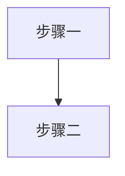
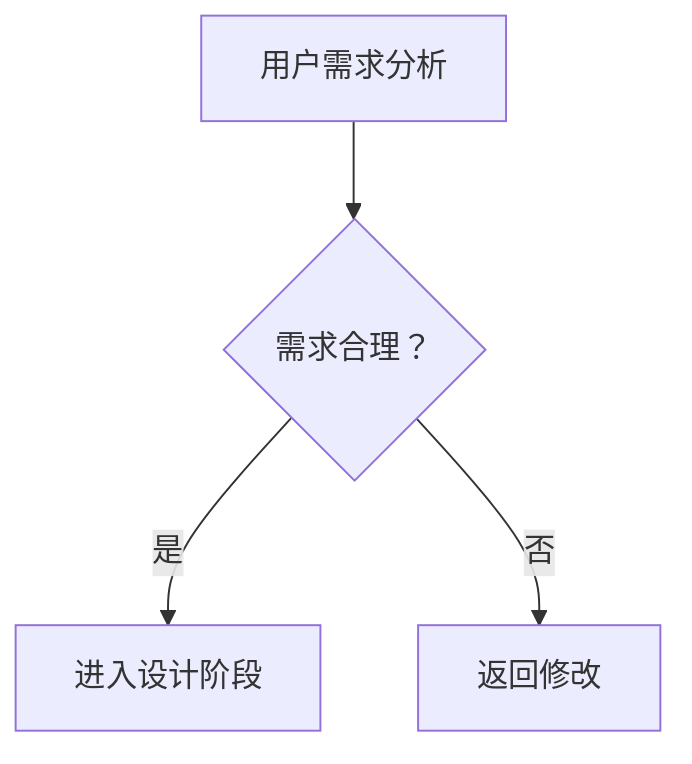
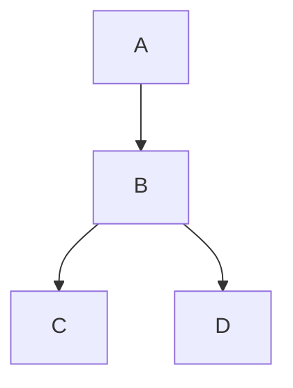

# 视觉资产生成策略

> 阶段4加载 | 封面/插图/Mermaid视觉资产策略
> 图表体系见 `templates.md` §八；排版规则见 `typography.md`；降级策略见 `build.md`

---

## §1 封面生成策略

### 三层路径

| 层级 | 方式 | 条件 | 说明 |
|------|------|------|------|
| **L1 位图封面** | 用户提供 `coverImage`；或宿主在对话中生成图像后**保存为项目内文件**并在配置中引用 | 依赖用户落盘路径与审核 | 品质取决于素材与宿主工具 |
| **L2 SVG设计封面** | 在 SVG 文字封面上叠加装饰元素 | `visualPreset` 字段非空 | 自动生成，无外部图像 API |
| **L3 SVG文字封面** | 纯文字+渐变色块 | 兜底 | 现有默认方案 |

用户提供 `coverImage`（外部图片）时跳过以上三层，直接使用。

### 封面装饰×预设映射

| 预设 | visualPreset | 装饰元素 | 视觉意图 |
|------|-------------|---------|---------|
| 🅰 实战手册 | `geometric` | 几何线条网格 + 工具图标轮廓 | 系统化、可操作 |
| 🅱 创业指南 | `wave` | 波浪曲线 + 渐变色块过渡 | 动态、叙事感 |
| 🅲 行业白皮书 | `grid` | 数据网格 + 数据点装饰 | 严谨、数据驱动 |
| 🅳 咨询手册 | `bubble` | 对话气泡 + 连接线 | 对话、亲和力 |
| 🅴 技能教程 | `ladder` | 阶梯/层级色块 + 箭头 | 递进、成长感 |

### 封面图像生成提示词模板

**通用结构**：
```
[风格基调], book cover design, [书名主题关键词],
primary color [主色hex], accent color [辅色hex],
[构图描述], Chinese text space reserved at top center,
professional publishing quality, high resolution, no text, no watermark
```

**五预设变体**：

**🅰 实战手册**：
```
clean geometric style, professional handbook cover design,
[主题关键词], steel blue #2C5F7C and gold #D4A843 accents,
structured grid layout with abstract tool icon silhouettes,
modern minimalist, Chinese text space reserved at top center,
professional publishing quality, no text, no watermark
```

**🅱 创业指南**：
```
warm narrative style, entrepreneurship guide cover design,
[主题关键词], amber orange #E67E22 gradient to warm gold,
flowing curves and rising path metaphor, human figure silhouettes,
inspiring and approachable, Chinese text space reserved at top center,
professional publishing quality, no text, no watermark
```

**🅲 行业白皮书**：
```
data-driven professional style, industry whitepaper cover design,
[主题关键词], deep cyan blue #1A5276 with light blue accents,
abstract data visualization background with grid pattern and connection lines,
authoritative and analytical, Chinese text space reserved at top center,
professional publishing quality, no text, no watermark
```

**🅳 咨询手册**：
```
approachable dialogue style, consulting handbook cover design,
[主题关键词], olive green #27AE60 with warm neutral tones,
speech bubble decorative elements and human connection metaphor,
trustworthy and professional, Chinese text space reserved at top center,
professional publishing quality, no text, no watermark
```

**🅴 技能教程**：
```
clear progressive style, skill tutorial cover design,
[主题关键词], lavender purple #8E44AD with light violet accents,
ascending steps or layered blocks showing progression,
clear and structured, Chinese text space reserved at top center,
professional publishing quality, no text, no watermark
```

> **关键约束**：prompt 中始终包含 `no text`，因为AI生成图片中的中文极易出错，文字一律后期叠加。
> 竞品调研与设计趋势参见 `封面设计知识准备.md`。

---

## §2 插图生成策略

### 三类插图定义

| 类型 | 用途 | 尺寸建议 | 位置 |
|------|------|---------|------|
| **章首插图** | 章标题下方的氛围装饰图 | 宽幅 16:9，低饱和度 | h1 紧接处 |
| **概念插图** | 解释抽象概念的可视化 | 4:3，清晰背景 | 段落间居中 |
| **场景插图** | 案例/故事中的场景还原 | 4:3，叙事性 | 段落间居中 |

### Markdown标记语法

```markdown
<!-- ILLUST: chapter-header | prompt: [提示词] -->

<!-- ILLUST: concept | prompt: [提示词] | caption: 图X-Y：[说明] -->

<!-- ILLUST: scene | prompt: [提示词] | caption: 图X-Y：[说明] -->
```

写作时（阶段3）只需插入标记，不中断写作流。构建时（阶段4）根据路径处理。

### 三路径生成

| 路径 | 条件 | 产出 |
|------|------|------|
| **路径A 宿主图像工具** | 宿主提供图像生成且用户同意保存到仓库 | 按 `ILLUST` 提示词生成 → 保存文件 → 在 MD 中引用路径 |
| **路径B SVG 抽象图** | 不依赖位图 API，由模型直接写 SVG | 几何抽象/图标组合 SVG 代码，嵌入 MD |
| **路径C 占位降级** | 兜底 | 保留标记，构建时生成占位色块 + prompt 文字 |

### 插图生成提示词模板

**章首插图**：
```
[插图风格关键词], wide banner illustration,
[章节核心主题], [书主色] color palette,
subtle and atmospheric, abstract background,
no text, no watermark, 16:9 aspect ratio,
suitable as chapter header decoration
```

**概念插图**：
```
[插图风格关键词], concept visualization,
[概念名称]: [视觉隐喻描述],
[书主色] color scheme, clean white background,
infographic aesthetic, clear and educational,
no text, no watermark, 4:3 aspect ratio
```

**场景插图**：
```
[插图风格关键词], scene illustration,
[场景描述]: [人物/环境/动作],
[书主色] color scheme, professional setting,
narrative and engaging, subtle details,
no text, no watermark, 4:3 aspect ratio
```

### 插图风格关键词（与预设对齐）

| 预设 | illustrationStyle | 关键词展开 |
|------|------------------|-----------|
| 🅰 实战手册 | `flat` | flat vector, geometric shapes, tool-focused, clean edges |
| 🅱 创业指南 | `watercolor` | warm watercolor, soft edges, human-centric, narrative |
| 🅲 行业白皮书 | `minimal` | minimal line art, data-driven, precise, monochrome accent |
| 🅳 咨询手册 | `line-art` | line art, conversational, approachable, hand-drawn feel |
| 🅴 技能教程 | `flat` | flat vector, step-by-step, progressive, vivid colors |

> **去AI味约束**：插图是内容的补充而非替代。每张插图必须提供文字无法传递的信息增量，"好看但无信息"的插图不合格。

---

## §3 VCR可视化×内容相关性检查体系

> 本节定义图表（插图/Mermaid/数据图）与文字内容相关性的质量门禁标准。
> 通过阈值：VCR总分 ≥ 7 分（满分10分）

### VCR评分矩阵（5维度）

| 维度 | 权重 | 评分标准 | 检测方法 |
|------|------|----------|----------|
| **时机合适性** | 20% | 图表出现在内容需要处，而非任意位置 | 检测章节是否包含图表引用标记；标记位置是否与内容逻辑对应 |
| **语义相关性** | 30% | 图表内容与文字描述一致，无矛盾 | 读取上下文文字内容，与图表表达的核心信息比对 |
| **增量价值** | 25% | 图表提供文字没有的信息增量 | 对比图表信息与文字描述，识别图表独有的数据/关系/趋势 |
| **层次匹配** | 15% | 图表复杂度与内容深度匹配 | 评估内容是概述/详细/专家级别，图表是否对应（不过于简单/不过于复杂） |
| **可读性** | 10% | 图表清晰易读（标签不重叠、色彩可辨、标题明确） | 目视检查图表元素间距、色彩对比度、图例完整性 |

**评分计算**：总分 = Σ(维度得分 × 权重)，满分10分

### VCR检查6步流程

```
Step 1: 检测章节是否包含图表引用标记
        ↓
Step 2: 获取图表内容（解析Markdown中的图表代码或图片引用）
        ↓
Step 3: 读取上下文文字内容（图表前后各50字范围）
        ↓
Step 4: 按5维度打分（每维度0-10分）
        ↓
Step 5: 汇总VCR总分 = Σ(维度得分 × 权重)
        ↓
Step 6: if 总分 < 7分 → 触发修改建议；else → 通过
```

### 6种典型失败模式速查

| # | 模式 | 特征 | 修复方向 |
|---|------|------|----------|
| **F1** | 装饰性图表 | 好看但与内容无关，文字删除后图表依然成立 | 删除或替换为相关图表 |
| **F2** | 重复文字内容 | 图表是文字的简单重复，无新信息 | 升级为数据对比/趋势/关系图 |
| **F3** | 断章取义 | 图表抽取了脱离上下文的数据，误导读者 | 补充上下文说明或调整数据范围 |
| **F4** | 复杂度失配 | 内容深奥但图表过于简单，或概览配复杂图 | 根据内容层次调整图表复杂度 |
| **F5** | 误导性展示 | 图表暗示性结论（如截断坐标轴、 cherry-picking数据） | 修正图表基础（坐标轴/数据选择） |
| **F6** | 可读性差 | 标签重叠、色彩难以分辨、缺少图例、标题缺失 | 优化布局/色彩对比/添加必要标注 |

### VCR质量门禁规则

- **通过阈值**：VCR总分 ≥ 7 分
- **打回标准**：VCR总分 < 7 分 → 退回修改，不进入下一阶段
- **特殊豁免**：装饰性章节首图（明确标记为"氛围装饰"）可豁免增量价值评估，仅检可读性

### VCR检查报告模板

```markdown
## VCR检查报告：第X章

**图表清单**：
- 图X-1：[类型] | 时机: X | 语义: X | 增量: X | 层次: X | 可读: X | **总分: X.X**

**未通过项**：
- 图X-Y：F2重复文字内容 → 建议升级为趋势对比图

**修改意见**：...
```

---

## §4 Mermaid 配色注入规范

> 本节为 Mermaid 配色与节点约束的**唯一定义位置**。`templates.md` 骨架模板中的 `[book.color]` 占位符运行时从风格档案解析。

### 标准注入头（写入每个Mermaid代码块首行）

```
%%{init: {
  'theme': 'base',
  'themeVariables': {
    'primaryColor': '[book.color]',
    'primaryTextColor': '#ffffff',
    'primaryBorderColor': '[book.color]',
    'lineColor': '[book.color]88',
    'secondaryColor': '[book.lightBg]',
    'tertiaryColor': '[book.accentBg]',
    'fontFamily': 'Source Han Sans SC, Microsoft YaHei, SimHei, sans-serif'
  }
}}%%
```

将 `[book.color]` / `[book.lightBg]` / `[book.accentBg]` 替换为实际配色值。

### 节点标签约束

| 约束 | 规则 |
|------|------|
| **最大字数** | **单节点标签 ≤15 个汉字** |
| 换行 | 超长用 `<br/>` 分行：`["第一行<br/>第二行"]` |
| ID命名 | 英文ID + 中文标签：`A["用户需求分析"]` |
| 特殊字符 | 标签中的括号用引号包裹：`A["分析(初步)"]` |

### 图注约定

Mermaid 代码块后紧跟图注注释：
```markdown

<!-- FIG: 2-1：用户分析流程 -->
```

图注格式统一为 `图 X-Y：说明`（X=章号，Y=章内序号）。**插图与Mermaid图表共享编号序列**，按出现顺序连续编号。

### 图表类型选择矩阵（7种类型+禁用场景）

| # | 类型 | 适用场景 | 禁用场景 | 示例关键词 |
|---|------|----------|----------|------------|
| **T1** | 流程图 flowchart | 步骤/决策/工作流 | 大量数据对比、时间序列 | "流程"、"步骤"、"环节"、"审批" |
| **T2** | 时序图 sequenceDiagram | 交互/通信/多角色行为 | 静态结构、单一对象 | "交互"、"调用"、"对话"、"通信" |
| **T3** | 状态图 stateDiagram | 状态变迁/生命周期 | 步骤流程、并行活动 | "状态"、"阶段"、"变迁"、"生命周期" |
| **T4** | ER图 erDiagram | 实体关系/数据结构 | 流程/步骤、行为描述 | "实体"、"关系"、"数据模型"、"数据库" |
| **T5** | 类图 classDiagram | 面向对象结构/继承关系 | 流程/步骤、具体业务 | "类"、"对象"、"继承"、"方法" |
| **T6** | 甘特图 gantt | 时间计划/里程碑 | 实时数据、状态关系 | "计划"、"里程碑"、"排期"、"周期" |
| **T7** | 饼图/柱图 pie/bar | 数据分布/对比 | 趋势演变、多维关系 | "占比"、"对比"、"分布"、"份额" |

**禁用总则**：
- 禁止用图表做纯装饰（好看但无信息增量）
- 禁止用图表重复文字已表达的信息
- 禁止用误导性图表（截断坐标轴、 cherry-picking数据）

### 连接线条件分支标注规范

**决策节点的条件分支必须标注"是/否"**：



**标注规则**：
| 规则 | 正确写法 | 错误写法 |
|------|----------|----------|
| 条件分支 | `-->|"是"|` 或 `-->|"否"|` | `-->` 无标注 |
| 多条件 | `-->|"条件A"|` `-->|"条件B"|` `-->|"条件C"|` | `-->` 混用 |
| 循环分支 | 标注"继续"或"重试" | 无标注 |

**不合格示例**：

*缺陷：条件分支B→C和B→D无"是/否"标注，无法判断条件含义*

---

## §5 视觉风格×五预设速查表

| 预设 | 主色 | 封面装饰 | Mermaid主色 | 插图风格 | 图表偏好 |
|------|------|---------|------------|---------|---------|
| 🅰 实战手册 | `#2C5F7C` | 几何线条 | `#2C5F7C` | flat, geometric | Mermaid流程图 |
| 🅱 创业指南 | `#E67E22` | 渐变波浪 | `#E67E22` | warm, watercolor | Mermaid时间线 |
| 🅲 行业白皮书 | `#1A5276` | 数据网格 | `#1A5276` | minimal, data | Mermaid+数据表 |
| 🅳 咨询手册 | `#27AE60` | 对话气泡 | `#27AE60` | line-art, conversational | Mermaid时序图 |
| 🅴 技能教程 | `#8E44AD` | 阶梯层级 | `#8E44AD` | flat, progressive | Mermaid步骤图 |

> 本表为速查；风格预设详见 `presets.md` §1，排版规则见 `typography.md`。
