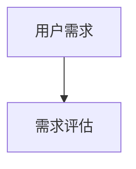

# Mermaid 流程图模板

> 模板版本：1.0.0
> 更新日期：2026-03-23
> 图表类型：flowchart TD / LR / TB
> 引用位置：`templates.md` §八

---

## 一、标准注入头

```mermaid
%%{init: {
  'theme': 'base',
  'themeVariables': {
    'primaryColor': '[book.color]',
    'primaryTextColor': '#ffffff',
    'primaryBorderColor': '[book.color]',
    'lineColor': '[book.color]88',
    'secondaryColor': '[book.lightBg]',
    'tertiaryColor': '[book.accentBg]',
    'fontFamily': 'Source Han Sans SC, Microsoft YaHei, SimHei, sans-serif'
  }
}}%%
```

> **配色注入**：将 `[book.color]` / `[book.lightBg]` / `[book.accentBg]` 替换为实际配色值（来自风格档案）。

---

## 二、基础模板

### 2.1 线性流程（TB方向）

```mermaid
%%{init: { 'theme': 'base', 'themeVariables': { 'primaryColor': '[book.color]', 'primaryTextColor': '#ffffff', 'primaryBorderColor': '[book.color]', 'lineColor': '[book.color]88', 'fontFamily': 'Source Han Sans SC, Microsoft YaHei, SimHei, sans-serif' } }}%%
flowchart TB
  A["步骤一"] --> B["步骤二"]
  B --> C["步骤三"]
  C --> D["步骤四"]
```

### 2.2 分支流程

```mermaid
%%{init: { 'theme': 'base', 'themeVariables': { 'primaryColor': '[book.color]', 'primaryTextColor': '#ffffff', 'primaryBorderColor': '[book.color]', 'lineColor': '[book.color]88', 'fontFamily': 'Source Han Sans SC, Microsoft YaHei, SimHei, sans-serif' } }}%%
flowchart TD
  A["开始"] --> B{条件判断}
  B -->|"是"| C["操作A"]
  B -->|"否"| D["操作B"]
  C --> E{"继续?"}
  D --> E
  E -->|"是"| F["下一步"]
  E -->|"否"| G["结束"]
```

---

## 三、使用指南

### 3.1 节点标签约束

| 约束 | 规则 |
|------|------|
| **最大字数** | 单节点标签 ≤15 个汉字 |
| 换行 | 超长用 `<br/>` 分行：`A["第一行<br/>第二行"]` |
| ID命名 | 英文ID + 中文标签：`A["用户需求分析"]` |
| 特殊字符 | 标签中的括号用引号包裹：`A["分析(初步)"]` |

### 3.2 决策分支标注规范

**决策节点的条件分支必须标注"是/否"或具体条件**：

```mermaid
%%{init: { 'theme': 'base', 'themeVariables': { 'primaryColor': '[book.color]', 'lineColor': '[book.color]88' } }}%%
flowchart TD
  A["需求分析"] --> B{需求合理?}
  B -->|"是<br/>预算充足"| C["进入设计"]
  B -->|"否<br/>需简化"| D["返回修改"]
```

### 3.3 图注约定

Mermaid 代码块后紧跟图注注释：

```markdown

<!-- FIG: 3-1：用户需求分析流程 -->
```

图注格式：`图 X-Y：说明`（X=章号，Y=章内序号）

### 3.4 选择原则

| 适用 | 不适用 |
|------|--------|
| 步骤/决策/工作流 | 大量数据对比 |
| 3个以上节点的流程 | 时间序列（用timeline） |
| 条件分支场景 | 静态结构关系（用stateDiagram） |

---

## 四、模板速查

```mermaid
%%{init: { 'theme': 'base', 'themeVariables': { 'primaryColor': '[book.color]', 'primaryTextColor': '#ffffff', 'primaryBorderColor': '[book.color]', 'lineColor': '[book.color]88', 'fontFamily': 'Source Han Sans SC, Microsoft YaHei, SimHei, sans-serif' } }}%%
flowchart TB
  A["开始"] --> B["输入"]
  B --> C{"判断"}
  C -->|"通过"| D["处理"]
  C -->|"拒绝"| E["结束"]
  D --> F["输出"]
  F --> G["结束"]
```
