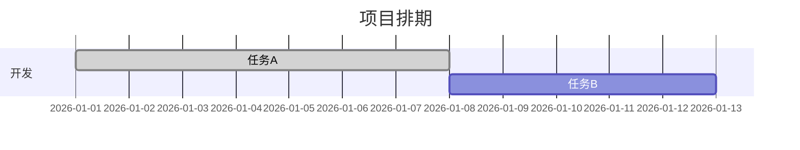

# Mermaid 甘特图模板

> 模板版本：1.0.0
> 更新日期：2026-03-23
> 图表类型：gantt
> 引用位置：`templates.md` §八

---

## 一、标准注入头

```mermaid
%%{init: {
  'theme': 'base',
  'themeVariables': {
    'primaryColor': '[book.color]',
    'primaryTextColor': '#ffffff',
    'primaryBorderColor': '[book.color]',
    'lineColor': '[book.color]88',
    'secondaryColor': '[book.lightBg]',
    'tertiaryColor': '[book.accentBg]',
    'fontFamily': 'Source Han Sans SC, Microsoft YaHei, SimHei, sans-serif'
  }
}}%%
```

---

## 二、基础模板

### 2.1 简单甘特图

```mermaid
%%{init: { 'theme': 'base', 'themeVariables': { 'primaryColor': '[book.color]', 'primaryTextColor': '#ffffff', 'primaryBorderColor': '[book.color]', 'lineColor': '[book.color]88', 'fontFamily': 'Source Han Sans SC, Microsoft YaHei, SimHei, sans-serif' } }}%%
gantt
  title 任务排期
  dateFormat  YYYY-MM-DD

  section 任务组A
  任务1: done, 2026-01-01, 7d
  任务2: active, 2026-01-08, 5d
  任务3: 2026-01-13, 3d

  section 任务组B
  任务4: 2026-01-08, 6d
  任务5: 2026-01-14, 4d
```

### 2.2 多阶段甘特图

```mermaid
%%{init: { 'theme': 'base', 'themeVariables': { 'primaryColor': '[book.color]', 'primaryTextColor': '#ffffff', 'primaryBorderColor': '[book.color]', 'lineColor': '[book.color]88', 'fontFamily': 'Source Han Sans SC, Microsoft YaHei, SimHei, sans-serif' } }}%%
gantt
  title 项目计划
  dateFormat  YYYY-MM-DD

  section 阶段一
  规划: done, 2026-01-01, 5d
  评审: milestone, 2026-01-06

  section 阶段二
  开发: 2026-01-07, 15d
  测试: 2026-01-22, 5d

  section 阶段三
  上线: 2026-01-27, 3d
  验收: milestone, 2026-01-30
```

---

## 三、使用指南

### 3.1 任务格式

```
任务名: 状态, 开始时间, 持续时长
```

| 状态 | 说明 |
|------|------|
| `done` | 已完成 |
| `active` | 进行中 |
| `milestone` | 里程碑节点 |

### 3.2 时间格式

| 格式 | 示例 |
|------|------|
| 日期 | `2026-01-01` |
| 持续天数 | `7d`（7天） |
| 周数 | `2w`（2周） |

### 3.3 标签约束

| 约束 | 规则 |
|------|------|
| **最大字数** | 任务名 ≤15 个汉字 |
| 简洁性 | 使用动宾短语 |

### 3.4 图注约定

```markdown

<!-- FIG: 8-1：项目甘特图 -->
```

### 3.5 选择原则

| 适用 | 不适用 |
|------|--------|
| 项目排期/里程碑 | 实时数据（用table） |
| 任务周期规划 | 静态结构（用stateDiagram） |
| 时间资源分配 | 流程步骤（用flowchart） |

---

## 四、模板速查

```mermaid
%%{init: { 'theme': 'base', 'themeVariables': { 'primaryColor': '[book.color]', 'primaryTextColor': '#ffffff', 'primaryBorderColor': '[book.color]', 'lineColor': '[book.color]88', 'fontFamily': 'Source Han Sans SC, Microsoft YaHei, SimHei, sans-serif' } }}%%
gantt
  title 计划安排
  dateFormat  YYYY-MM-DD
  section 任务
  任务A: done, 2026-01-01, 5d
  任务B: active, 2026-01-06, 3d
  任务C: 2026-01-09, 2d
```
