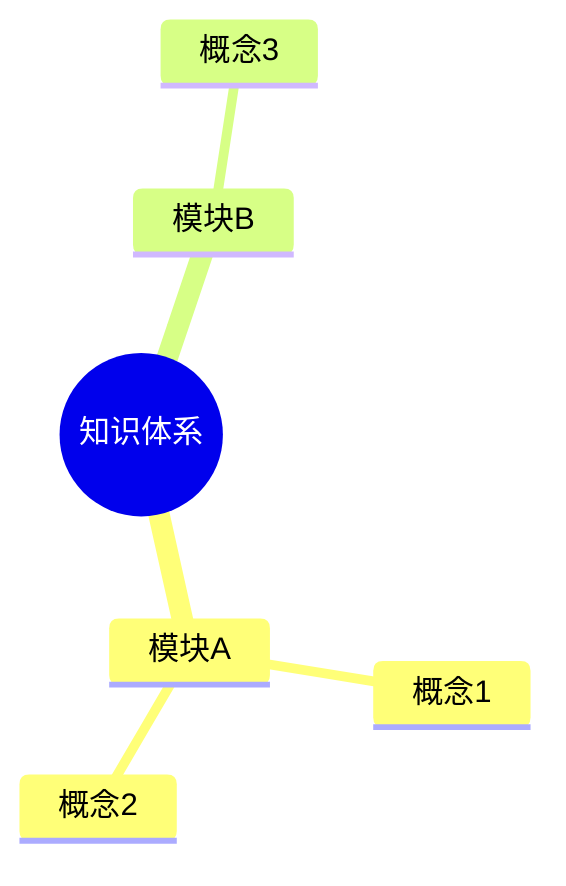

# Mermaid 思维导图模板

> 模板版本：1.0.0
> 更新日期：2026-03-23
> 图表类型：mindmap
> 引用位置：`templates.md` §八

---

## 一、标准注入头

```mermaid
%%{init: {
  'theme': 'base',
  'themeVariables': {
    'primaryColor': '[book.color]',
    'primaryTextColor': '#ffffff',
    'primaryBorderColor': '[book.color]',
    'lineColor': '[book.color]88',
    'secondaryColor': '[book.lightBg]',
    'tertiaryColor': '[book.accentBg]',
    'fontFamily': 'Source Han Sans SC, Microsoft YaHei, SimHei, sans-serif'
  }
}}%%
```

---

## 二、基础模板

### 2.1 单层级思维导图

```mermaid
%%{init: { 'theme': 'base', 'themeVariables': { 'primaryColor': '[book.color]', 'primaryTextColor': '#ffffff', 'primaryBorderColor': '[book.color]', 'lineColor': '[book.color]88', 'fontFamily': 'Source Han Sans SC, Microsoft YaHei, SimHei, sans-serif' } }}%%
mindmap
  root((主题))
    分支一
      子节点A
      子节点B
    分支二
      子节点C
      子节点D
```

### 2.2 多层级导图

```mermaid
%%{init: { 'theme': 'base', 'themeVariables': { 'primaryColor': '[book.color]', 'primaryTextColor': '#ffffff', 'primaryBorderColor': '[book.color]', 'lineColor': '[book.color]88', 'fontFamily': 'Source Han Sans SC, Microsoft YaHei, SimHei, sans-serif' } }}%%
mindmap
  root((核心概念))
    维度一
      要点1.1
        细节A
        细节B
      要点1.2
    维度二
      要点2.1
      要点2.2
    维度三
      要点3.1
        细节C
```

---

## 三、使用指南

### 3.1 节点标签约束

| 约束 | 规则 |
|------|------|
| **最大字数** | 单节点标签 ≤15 个汉字 |
| 层级结构 | 根节点 → 分支 → 子节点，逐级展开 |
| 简洁性 | 每个节点一个核心概念 |

### 3.2 布局说明

- `root((标题))` - 中心主题，用双括号
- `分支` - 一级分支，普通文本
- `  子节点` - 二级分支，缩进
- `    细节` - 三级分支，缩进更多

### 3.3 图注约定

```markdown

<!-- FIG: 6-1：知识结构导图 -->
```

### 3.4 选择原则

| 适用 | 不适用 |
|------|--------|
| 概念发散/分类 | 步骤流程（用flowchart） |
| 知识结构梳理 | 时间序列（用timeline） |
| 头脑风暴整理 | 项目排期（用gantt） |

---

## 四、模板速查

```mermaid
%%{init: { 'theme': 'base', 'themeVariables': { 'primaryColor': '[book.color]', 'primaryTextColor': '#ffffff', 'primaryBorderColor': '[book.color]', 'lineColor': '[book.color]88', 'fontFamily': 'Source Han Sans SC, Microsoft YaHei, SimHei, sans-serif' } }}%%
mindmap
  root((主题))
    分类A
      要点1
      要点2
    分类B
      要点3
      要点4
```
