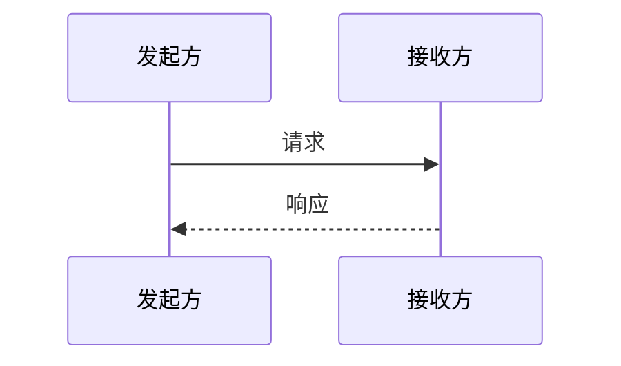

# Mermaid 时序图模板

> 模板版本：1.0.0
> 更新日期：2026-03-23
> 图表类型：sequenceDiagram
> 引用位置：`templates.md` §八

---

## 一、标准注入头

```mermaid
%%{init: {
  'theme': 'base',
  'themeVariables': {
    'primaryColor': '[book.color]',
    'primaryTextColor': '#ffffff',
    'primaryBorderColor': '[book.color]',
    'lineColor': '[book.color]88',
    'secondaryColor': '[book.lightBg]',
    'tertiaryColor': '[book.accentBg]',
    'fontFamily': 'Source Han Sans SC, Microsoft YaHei, SimHei, sans-serif'
  }
}}%%
```

> **配色注入**：将 `[book.color]` / `[book.lightBg]` / `[book.accentBg]` 替换为实际配色值。

---

## 二、基础模板

### 2.1 双方交互

```mermaid
%%{init: { 'theme': 'base', 'themeVariables': { 'primaryColor': '[book.color]', 'lineColor': '[book.color]88', 'fontFamily': 'Source Han Sans SC, Microsoft YaHei, SimHei, sans-serif' } }}%%
sequenceDiagram
  participant A as 角色A
  participant B as 角色B

  A->>B: 请求操作
  B-->>A: 返回结果
```

### 2.2 多方交互

```mermaid
%%{init: { 'theme': 'base', 'themeVariables': { 'primaryColor': '[book.color]', 'lineColor': '[book.color]88', 'fontFamily': 'Source Han Sans SC, Microsoft YaHei, SimHei, sans-serif' } }}%%
sequenceDiagram
  participant U as 用户
  participant F as 前端
  participant B as 后端
  participant D as 数据库

  U->>F: 提交请求
  F->>B: API调用
  B->>D: 查询数据
  D-->>B: 返回结果
  B-->>F: API响应
  F-->>U: 展示结果
```

---

## 三、自调用循环

```mermaid
%%{init: { 'theme': 'base', 'themeVariables': { 'primaryColor': '[book.color]', 'lineColor': '[book.color]88', 'fontFamily': 'Source Han Sans SC, Microsoft YaHei, SimHei, sans-serif' } }}%%
sequenceDiagram
  participant C as 客户端

  loop 循环处理
    C->>C: 处理任务
    C->>C: 验证结果
  end

  C-->>C: 输出最终结果
```

---

## 四、使用指南

### 4.1 箭头类型

| 类型 | 符号 | 用途 |
|------|------|------|
| 实线箭头 | `->>` | 同步请求 |
| 虚线箭头 | `-->>` | 响应返回 |
| 异步箭头 | `->` | 异步发送 |
| 丢失 | `x` | 消息丢失 |

### 4.2 节点标签约束

| 约束 | 规则 |
|------|------|
| **最大字数** | 单节点标签 ≤15 个汉字 |
| 参与者命名 | 使用角色名称而非具体人名 |

### 4.3 图注约定

```markdown

<!-- FIG: 4-1：操作时序 -->
```

### 4.4 选择原则

| 适用 | 不适用 |
|------|--------|
| 交互/通信/多角色行为 | 静态结构 |
| 请求-响应场景 | 单一对象流程（用flowchart） |
| 系统交互时序 | 数据对比（用table） |

---

## 五、模板速查

```mermaid
%%{init: { 'theme': 'base', 'themeVariables': { 'primaryColor': '[book.color]', 'lineColor': '[book.color]88', 'fontFamily': 'Source Han Sans SC, Microsoft YaHei, SimHei, sans-serif' } }}%%
sequenceDiagram
  participant S as 发送方
  participant R as 接收方

  S->>R: 发送请求
  R-->>S: 返回确认
```
