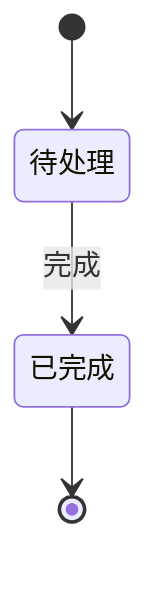

# Mermaid 状态图模板

> 模板版本：1.0.0
> 更新日期：2026-03-23
> 图表类型：stateDiagram-v2
> 引用位置：`templates.md` §八

---

## 一、标准注入头

```mermaid
%%{init: {
  'theme': 'base',
  'themeVariables': {
    'primaryColor': '[book.color]',
    'primaryTextColor': '#ffffff',
    'primaryBorderColor': '[book.color]',
    'lineColor': '[book.color]88',
    'secondaryColor': '[book.lightBg]',
    'tertiaryColor': '[book.accentBg]',
    'fontFamily': 'Source Han Sans SC, Microsoft YaHei, SimHei, sans-serif'
  }
}}%%
```

---

## 二、基础模板

### 2.1 简单状态转换

```mermaid
%%{init: { 'theme': 'base', 'themeVariables': { 'primaryColor': '[book.color]', 'primaryTextColor': '#ffffff', 'primaryBorderColor': '[book.color]', 'lineColor': '[book.color]88', 'fontFamily': 'Source Han Sans SC, Microsoft YaHei, SimHei, sans-serif' } }}%%
stateDiagram-v2
  [*] --> 初始状态
  初始状态 --> 进行中: 事件A
  进行中 --> 完成: 事件B
  完成 --> [*]
```

### 2.2 多状态分支

```mermaid
%%{init: { 'theme': 'base', 'themeVariables': { 'primaryColor': '[book.color]', 'primaryTextColor': '#ffffff', 'primaryBorderColor': '[book.color]', 'lineColor': '[book.color]88', 'fontFamily': 'Source Han Sans SC, Microsoft YaHei, SimHei, sans-serif' } }}%%
stateDiagram-v2
  [*] --> 待处理

  state 待处理 {
    [*] --> 审核中
    审核中 --> 审核通过: 批准
    审核中 --> 审核拒绝: 拒绝
  }

  审核通过 --> 已发布: 上线
  审核拒绝 --> 待处理: 重新提交
  已发布 --> [*]
```

### 2.3 状态与动作

```mermaid
%%{init: { 'theme': 'base', 'themeVariables': { 'primaryColor': '[book.color]', 'primaryTextColor': '#ffffff', 'primaryBorderColor': '[book.color]', 'lineColor': '[book.color]88', 'fontFamily': 'Source Han Sans SC, Microsoft YaHei, SimHei, sans-serif' } }}%%
stateDiagram-v2
  [*] --> 空闲

  state 空闲 {
    [*] --> idle_entry: 进入
    idle_entry --> idle: 完成
    idle --> idle_exit: 退出
    idle_exit --> [*]: 离开
  }

  空闲 --> 活动中: 激活
  活动中 --> 空闲: 结束
```

---

## 三、使用指南

### 3.1 状态命名约束

| 约束 | 规则 |
|------|------|
| **最大字数** | 状态名 ≤15 个汉字 |
| 动宾结构 | 使用"动词+名词"：`审核中`、`已完成` |
| 简洁性 | 避免过长描述 |

### 3.2 转换标注

```mermaid
%%{init: { 'theme': 'base', 'themeVariables': { 'primaryColor': '[book.color]', 'lineColor': '[book.color]88' } }}%%
stateDiagram-v2
  [*] --> A
  A --> B: 事件/条件
```

### 3.3 图注约定

```markdown

<!-- FIG: 5-1：任务状态流转 -->
```

### 3.4 选择原则

| 适用 | 不适用 |
|------|--------|
| 状态变迁/生命周期 | 步骤流程（用flowchart） |
| 阶段转换场景 | 并行活动（用flowchart） |
| 对象状态管理 | 角色交互（用sequenceDiagram） |

---

## 四、模板速查

```mermaid
%%{init: { 'theme': 'base', 'themeVariables': { 'primaryColor': '[book.color]', 'primaryTextColor': '#ffffff', 'primaryBorderColor': '[book.color]', 'lineColor': '[book.color]88', 'fontFamily': 'Source Han Sans SC, Microsoft YaHei, SimHei, sans-serif' } }}%%
stateDiagram-v2
  [*] --> 状态A
  状态A --> 状态B: 事件
  状态B --> 状态C: 事件
  状态C --> [*]
```
