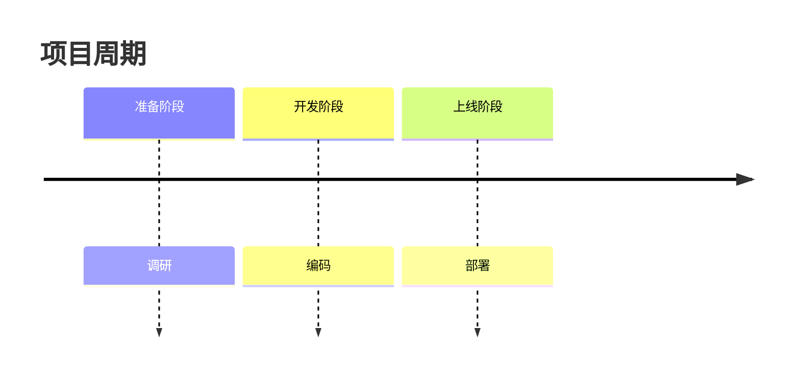

# Mermaid 时间线模板

> 模板版本：1.0.0
> 更新日期：2026-03-23
> 图表类型：timeline
> 引用位置：`templates.md` §八

---

## 一、标准注入头

```mermaid
%%{init: {
  'theme': 'base',
  'themeVariables': {
    'primaryColor': '[book.color]',
    'primaryTextColor': '#ffffff',
    'primaryBorderColor': '[book.color]',
    'lineColor': '[book.color]88',
    'secondaryColor': '[book.lightBg]',
    'tertiaryColor': '[book.accentBg]',
    'fontFamily': 'Source Han Sans SC, Microsoft YaHei, SimHei, sans-serif'
  }
}}%%
```

---

## 二、基础模板

### 2.1 简单时间线

```mermaid
%%{init: { 'theme': 'base', 'themeVariables': { 'primaryColor': '[book.color]', 'primaryTextColor': '#ffffff', 'primaryBorderColor': '[book.color]', 'lineColor': '[book.color]88', 'fontFamily': 'Source Han Sans SC, Microsoft YaHei, SimHei, sans-serif' } }}%%
timeline
  title 时间标题
    阶段一: 任务A
    阶段二: 任务B
    阶段三: 任务C
```

### 2.2 详细时间线

```mermaid
%%{init: { 'theme': 'base', 'themeVariables': { 'primaryColor': '[book.color]', 'primaryTextColor': '#ffffff', 'primaryBorderColor': '[book.color]', 'lineColor': '[book.color]88', 'fontFamily': 'Source Han Sans SC, Microsoft YaHei, SimHei, sans-serif' } }}%%
timeline
  title 项目阶段

    阶段一：规划
      需求调研
      方案设计
      评审通过

    阶段二：执行
      开发启动
      迭代开发
      测试验证

    阶段三：收尾
      上线部署
      用户培训
      项目验收
```

---

## 三、使用指南

### 3.1 标签约束

| 约束 | 规则 |
|------|------|
| **最大字数** | 单标签 ≤15 个汉字 |
| 阶段划分 | 按时间或里程碑切分 |
| 任务描述 | 简洁的动宾结构 |

### 3.2 时间格式

```
阶段名：任务描述
  子任务1
  子任务2
```

### 3.3 图注约定

```markdown

<!-- FIG: 7-1：项目实施时间线 -->
```

### 3.4 选择原则

| 适用 | 不适用 |
|------|--------|
| 阶段时间线 | 实时数据（用table） |
| 项目实施过程 | 静态结构（用stateDiagram） |
| 历史发展脉络 | 任务排期（用gantt） |

---

## 四、模板速查

```mermaid
%%{init: { 'theme': 'base', 'themeVariables': { 'primaryColor': '[book.color]', 'primaryTextColor': '#ffffff', 'primaryBorderColor': '[book.color]', 'lineColor': '[book.color]88', 'fontFamily': 'Source Han Sans SC, Microsoft YaHei, SimHei, sans-serif' } }}%%
timeline
  title 阶段概览
    阶段一: 任务A
    阶段二: 任务B
    阶段三: 任务C
```
